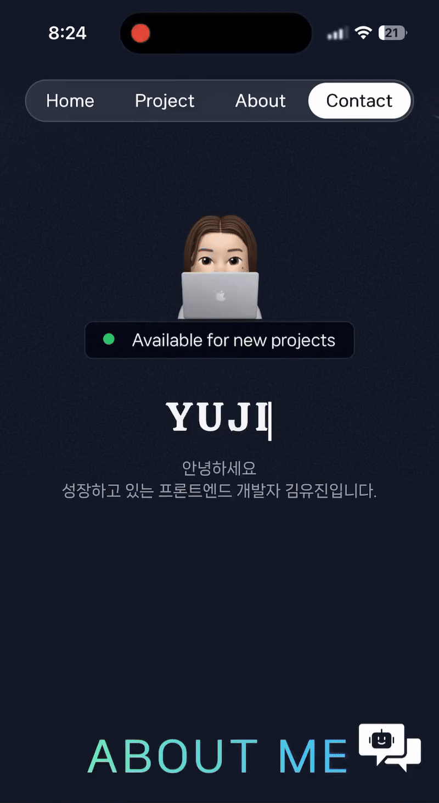
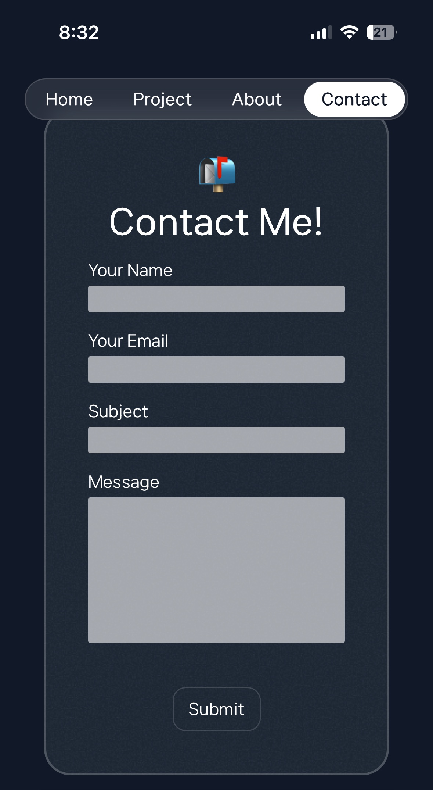

<h1 align="center">포트폴리오 웹사이트 지니지니온라인</h1>

  

🚩 배포 URL : https://www.jinijini.online/

## 프로젝트 소개

### [AI Chatbot]

  

- 하단의 말풍선 클릭시 이용 가능합니다.
- OpenAI의 GPT-3.5-turbo 모델을 활용한 AI 챗봇입니다.
- public/markdown 폴더 내 마크다운 파일을 프롬프트에 포함해 김유진의 정보 및 프로젝트 관련 질문에 답변합니다.
- GPT API 사용 비용 최소화를 위해 비밀번호 인증 후 이용이 가능합니다.

### [Email 보내기 기능]

  

- Nodemailer를 활용하여 사용자가 입력한 내용을 지정된 이메일로 전송하는 기능을 구현하였습니다.

## 기술스택

  
  

